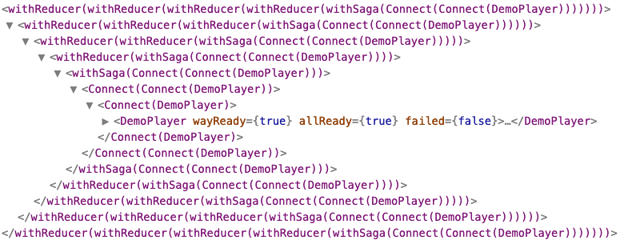

# React workshop - hooks

https://reactjs.org/docs/hooks-intro.html

A react hook is a method to call in a function component or in a custom React hook.

```js
function MyComponent() {
  const [value, setValue] = React.useState('');
  return (
    <input
      type="text"
      value={value}
      onChange={(event) => setValue(event.target.value)}
    />
  );
}
```

## Motivation

- https://reactjs.org/docs/hooks-intro.html#motivation

### HOC vs hooks

> HOC: Higher Order Component

cf. https://reactjs.org/docs/higher-order-components.html

```js
function withUser(WrappedComponent) {
  return class WithUser extends React.Component {
    render() {
      return <WrappedComponent {...this.props} user={this.state.user} />;
    }
  };
}
```

```js
function withProducts(WrappedComponent) {
  return class WithProducts extends React.Component {
    // ...
    render() {
      return (
        <WrappedComponent {...this.props} products={this.state.products} />
      );
    }
  };
}
```

```js
class MyComponent extends React.Component {
  // ...
  render() {
    return (
      <>
        <div>{this.props.user?.name}</div>
        <ul>
          {this.props.products?.map((product) => (
            <li>{product?.name}</li>
          ))}
        </ul>
      </>
    );
  }
}

export withUser(withProducts(MyComponent))
```

Component tree:

```
- WithUser
  |- WithProducts
     |- MyComponent
```

Here a HOC hell example:



So now with React hooks:

```js
function useUser() {
  // ...
  return user;
}
```

```js
function useProducts() {
  // ...
  return products;
}
```

```js
function MyComponent() {
  const user = useUser();
  const products = useProducts();

  return (
    <>
      <div>{user?.name}</div>
      <ul>
        {products?.map((product) => (
          <li>{product?.name}</li>
        ))}
      </ul>
    </>
  );
}
```

Component tree:

```
- MyComponent
```

\o/

### Native Hooks

- https://reactjs.org/docs/hooks-reference.html

Available hooks in the React API:

**The ones you'll use in Alkemics codebase:**

#### useState

```js
function MyComponent() {
  const [value, setValue] = React.useState('');
  return (
    <input
      type="text"
      value={value}
      onChange={(event) => setValue(event.target.value)}
    />
  );
}
```

### useEffect

> To handle side effects and asynchronous workflows

```js
function MyComponent({ userId }) {
  const [user, setUser] = React.useState();
  React.useEffect(() => {
    const abort = false;
    const fetchUser = async () => {
      const r = fetch(`/user/${userId}`);
      if (!abort) {
        const u = await r.json();
        setUser(u);
      }
    };
    return () => {
      abort = true;
    };
  }, [userId]);
  return <div>{this.props.user?.name}</div>;
}
```

#### useMemo

> To memoize a value

```js
function MyComponent({ products }) {
  const productNames = React.useMemo(
    () => products.map((product) => product.name),
    [products]
  );
  return <div>{productNames.join(', ')}</div>;
}
```

#### useCallback

> To memoize a callback

```js
function MyComponent() {
  const onChange = React.useCallback((event) => {
    dispatch({ type: 'SOME_action', payload: event.target.value });
  }, []);
  return <MyOtherCompent onChange={onChange} />;
}
```

#### useRef

> To persist a mutable object, it can be used to access to a DOM element

```js
function MyComponent() {
  const inputRef = React.useRef();
  React.useEffect(() => {
    inputRef.current.focus();
  }, []);
  const isMounted = React.useRef(true);
  React.useEffect(() => {
    fetch('/data').then((response) => {
      if (isMounted.current) {
        // do something with the response
      }
    });
    return () => {
      isMounted.current = false;
    };
  }, []);
  return (
    <div>
      <input type="text" ref={inputRef} />
    </div>
  );
}
```

**The ones you won't:**

#### useContext

> To use React Context

```js
const UserContext = React.createContext(null);

function Root() {
  return (
    <UserContext.Provider value={user}>
      <SomeComponentsTree />
    </UserContext.Provider>
  );
}

function MyComponent() {
  const user = React.useContext(UserContext);
  return <h1>{user?.name}</h1>;
}
```

#### useReducer

> To handle reducers with something quite similar do Redux

```js
const initialState = { count: 0 };

function reducer(state, action) {
  switch (action.type) {
    case 'increment':
      return { count: state.count + 1 };
    case 'decrement':
      return { count: state.count - 1 };
    default:
      throw new Error();
  }
}

function Counter() {
  const [state, dispatch] = React.useReducer(reducer, initialState);
  return (
    <>
      Count: {state.count}
      <button onClick={() => dispatch({ type: 'decrement' })}>-</button>
      <button onClick={() => dispatch({ type: 'increment' })}>+</button>
    </>
  );
}
```

#### useLayoutEffect

> Same as useEffect but executed synchronously after DOM mutations

```js
function MyComponent({ value }) {
  React.useEffect(() => {
    // when value change, execute some logic which affect the DOM
    // it might blink since useEffect is executed asynchronously
    // after browser painting
  }, [value]);
  React.useLayoutEffect(() => {
    // when value change, execute some logic which affect the DOM
    // this is executed synchronously just after React DOM mutations
    // so you avoid some rendering blink effects
  }, [value]);
  return <Something />;
}
```

#### useImperativeHandle

> To customize the instance value that is exposed to parent components when using ref

```js
const FancyInput = forwardRef(function _FancyInput(props, ref) {
  const inputRef = useRef();
  React.useImperativeHandle(ref, () => ({
    focus: () => {
      inputRef.current.focus();
    }
  }));
  return <input ref={inputRef} ... />;
});

function MyComponent() {
  const inputRef = React.useRef();
  React.useEffect(() => {
    inputRef.current.focus();
  }, []);
  return <FancyInput ref={inputRef} />;
}
```

#### useDebugValue

> To display a label for custom hooks in React DevTools

```js
function useFriendStatus(friendID) {
  const [isOnline, setIsOnline] = useState(null);
  // ...
  // Show a label in DevTools next to this Hook
  // e.g. "FriendStatus: Online"
  useDebugValue(isOnline ? 'Online' : 'Offline');
  return isOnline;
}
```

### Rules of Hooks

https://reactjs.org/docs/hooks-rules.html

- **Only Call Hooks at the Top Level**

  > Don’t call Hooks inside loops, conditions, or nested functions. Instead, always use Hooks at the top level of your React function. By following this rule, you ensure that Hooks are called in the same order each time a component renders. That’s what allows React to correctly preserve the state of Hooks between multiple useState and useEffect calls. (If you’re curious, we’ll explain this in depth below.)

- **Only Call Hooks from React Functions**

  > Don’t call Hooks from regular JavaScript functions. Instead, you can:
  > ✅ Call Hooks from React function components.
  > ✅ Call Hooks from custom Hooks (we’ll learn about them on the next page).
  > By following this rule, you ensure that all stateful logic in a component is clearly visible from its source code.

Eslint plugin `eslint-plugin-react-hooks` might help

```bash
npm install eslint-plugin-react-hooks --save-dev
```

### Hook flow

[React Hooks flow](./022_hook-flow.pdf)
